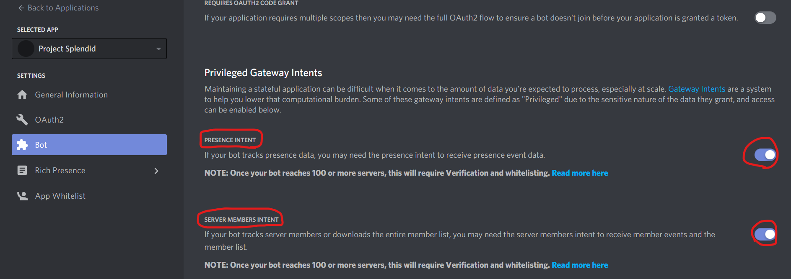

> ⚠ This bot was written with an older API and won't function anymore. This is a raw proof-of-concept project with no polish.

# Splendid - A bot

**Splendid** is a discord bot written in Python using the API which discord provides

This is my first discord bot and I aim to improve upon this bot as long as I feel like doing so

You can use clone/fork this repo and modify it as you wish

This repo is under the GPL3.0 License

## Setup

See the `envsample.envsample` for important info

You need to setup the above mentioned file to make the bot work

To Run the bot you need a `discord API` key

To use the [NEWS](https://github.com/WatermelonSalt/Splendid-Discord_Bot#NEWS) feature you need a `NEWSAPI` key

[This article](https://www.freecodecamp.org/news/create-a-discord-bot-with-python/) will guide you through the basic setup of the bot itself through the developer portal

Also you have to enable discord intents at the developer portal like shown below

<br>


<br>After setting up the bot, all you need to do is run the `main.py` file and the bot will be up and running

## Dependencies

You will need:

* Python3.8+
* discord v1.0.1
* discordpy v1.6.0
* Flask v1.1.2
* python-dotenv v0.15.0
* requests v2.24.0

You can install them by pasting the below line in your commadline

```
pip install discord==1.0.1 discord.py==1.6.0 Flask==1.1.2 python-dotenv==0.15.0 requests==2.24.0
```
<br>

## Features

### Guide on ping

When the bot is pinged by a user, the bot responds with a message saying that the user has to type `$#help` to know how to use the bot

I don't know if it can be considered a feature but here it is

### NEWS

This bot can fetch news and send the results via a private DM to the user who uses the command

It uses `NEWSAPI` to get the news and the bot host needs a `NEWSAPI` key from https://newsapi.org

The free plan can be used to handle atmost 100 request per day and they also offer premium plans

### TIC-TAC-TOE

This bot can conduct a tic-tac-toe game session between two players and determine the winner or announce a tie when the game ends

This does not have a "Play with the bot mode" so you need two players to use this feature

## Upcoming Features

* ~~Tic-Tac-Toe on chat~~
* Ebay search on chat

## Customization

The customizations are available under the `envsample.envsample` file which will be renamed to `.env`

* Name of the bot
* Status of the bot
* Activity of the bot
* Prefix of the bot
* Emojis used for X and O in Tic-Tac-Toe game
